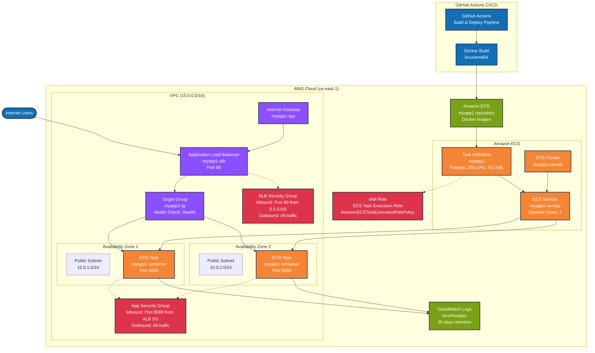

# AWS Architecture Diagram - MyApp1

## Architecture Overview

This diagram illustrates the AWS infrastructure for the MyApp1 application deployed using ECS Fargate.

## Component Details

### Networking Layer
- **VPC**: Custom VPC with CIDR 10.0.0.0/16
- **Subnets**: 2 public subnets across different AZs (10.0.1.0/24, 10.0.2.0/24)
- **Internet Gateway**: Provides internet access to public subnets
- **Route Table**: Routes traffic from public subnets to internet gateway

### Load Balancing
- **Application Load Balancer**: Internet-facing ALB listening on port 80
- **Target Group**: Routes traffic to ECS tasks on port 8080
- **Health Checks**: Configured to check `/health` endpoint

### Container Platform
- **ECS Cluster**: Fargate cluster for serverless container execution
- **Task Definition**: Defines container specifications (256 CPU, 512 MB memory)
- **ECS Service**: Manages desired count of tasks (currently 1)
- **Container**: .NET application running on port 8080

### Container Registry
- **ECR Repository**: Stores Docker images for the application
- **Image Scanning**: Enabled for security vulnerability scanning

### Security
- **ALB Security Group**: Allows inbound HTTP (port 80) from internet
- **App Security Group**: Allows inbound traffic (port 8080) only from ALB
- **IAM Role**: ECS task execution role with necessary permissions

### Monitoring & Logging
- **CloudWatch Logs**: Centralized logging with 30-day retention
- **Log Groups**: `/ecs/myapp1` for application logs

### CI/CD Pipeline
- **GitHub Actions**: Automated build and deployment
- **Docker Build**: Multi-platform build (linux/amd64)
- **ECR Push**: Pushes new images to ECR repository
- **ECS Update**: Updates service with new task definition

## Traffic Flow

1. **User Request**: Internet users access the application
2. **Load Balancer**: ALB receives requests on port 80
3. **Target Group**: Distributes traffic to healthy ECS tasks
4. **ECS Tasks**: Fargate tasks running in public subnets handle requests
5. **Logging**: Application logs sent to CloudWatch
6. **Health Checks**: ALB monitors task health via `/health` endpoint

## High Availability Features

- **Multi-AZ Deployment**: Tasks can run across multiple availability zones
- **Auto Scaling**: ECS service can scale based on demand (currently set to 1)
- **Health Monitoring**: Automatic replacement of unhealthy tasks
- **Rolling Updates**: Zero-downtime deployments via ECS service updates

## Security Features

- **Security Groups**: Network-level access control
- **Private Networking**: Tasks communicate via private IPs
- **IAM Roles**: Least privilege access for ECS tasks
- **ECR Scanning**: Vulnerability scanning for container images
